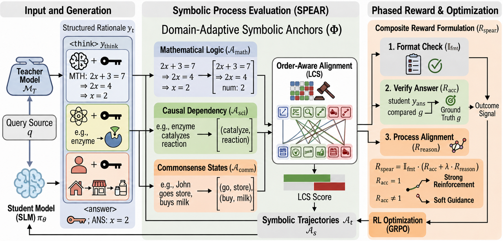

# SPEAR


## Repository layout

- `sft.py`: supervised fine-tuning.
- `rl.py`: unified GRPO, Dr. GRPO, and DAPO training entry point.
- `grpo.py`, `dr_grpo.py`, `dapo.py`: standalone training scripts.
- `reward.py`: format, answer-accuracy, and reasoning-alignment rewards.
- `test.py`: model evaluation.
- `collect_teacher_res.py`: teacher-rationale collection through the DeepSeek API.
- `data.py`, `utils.py`, `all_prompts.py`: data and prompt utilities.
- `data/`: teacher-generated rationale files.

## Installation

Python 3.10 or newer is recommended. Install the dependencies and the spaCy
English pipeline:

```bash
python -m pip install -r requirements.txt
python -m spacy download en_core_web_sm
```

For gated Hugging Face models or datasets, authenticate with the CLI or set
`HF_TOKEN`. For experiment tracking, authenticate with `wandb login`. Teacher
data collection requires `DEEPSEEK_API_KEY`.

```bash
export HF_TOKEN="..."
export DEEPSEEK_API_KEY="..."
wandb login
```

## Usage

Supervised fine-tuning:

```bash
python sft.py \
  --model_path meta-llama/Meta-Llama-3-8B-Instruct \
  --answer_path data/gsm8k_deepseek_answer_prompt.jsonl \
  --output_path checkpoints/spear-sft
```

Reinforcement learning with the unified entry point:

```bash
python rl.py \
  --algorithm grpo \
  --model_path meta-llama/Meta-Llama-3-8B-Instruct \
  --answer_path data/gsm8k_deepseek_answer_prompt.jsonl \
  --task_type gsm8k \
  --output_path checkpoints/spear-grpo
```

Use `--algorithm dr_grpo` or `--algorithm dapo` for the other objectives.
Pass `--baseline` to use only format and answer-accuracy rewards.

Evaluation:

```bash
python test.py \
  --model_path meta-llama/Meta-Llama-3-8B-Instruct \
  --lora_path checkpoints/spear-grpo \
  --dataset gsm8k
```

Each script supports `--help` for its full set of options. Training requires a
CUDA-capable environment with bfloat16 support; memory requirements depend on
the selected model and batch size.

<!-- ## Citation

Add a BibTeX entry here when the paper is public. -->
